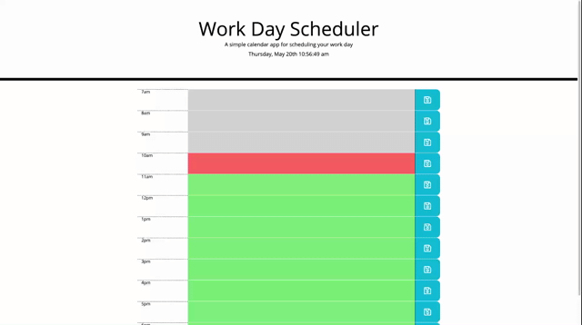

# calendar-app

Your day just got more organized!

## The way it works

The calendar app is a simple lightweight app that lets you schedule tasks through the course of your day. I used Jquery and Vanillia js to accomplish this task. When you click on a time block task field you are presented with a text input. You then can type in your task and click the same button, or click off the field and your task is then saved to local storage. You're also presented with an easy to understand color class for items in the past present or future.

## Technoligies used

This is mainly jquery and vanilla js. with some html and css minipulation.

## Inspirations and Resources

I worked with Michael Ruiz on part of the project.
His Github is : https://github.com/Frostquill

## Live link

https://mcewball13.github.io/calendar-app/